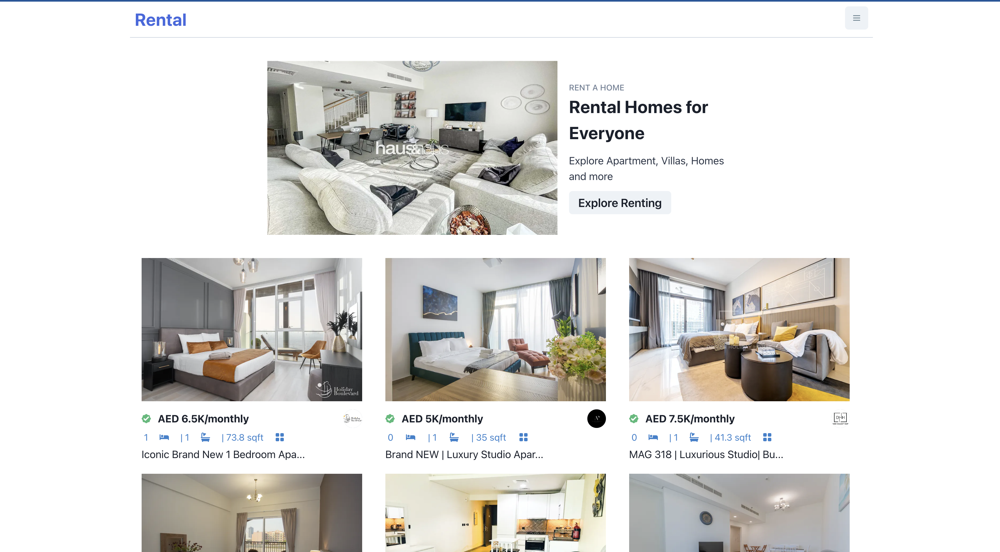
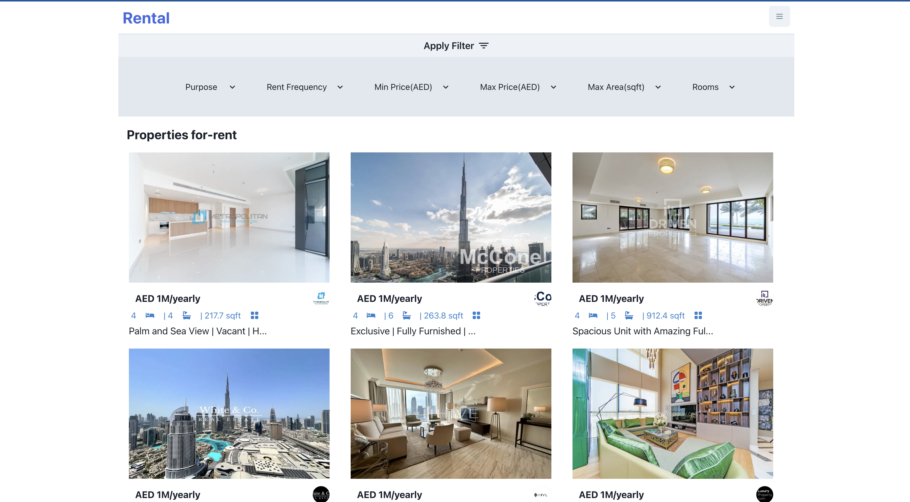
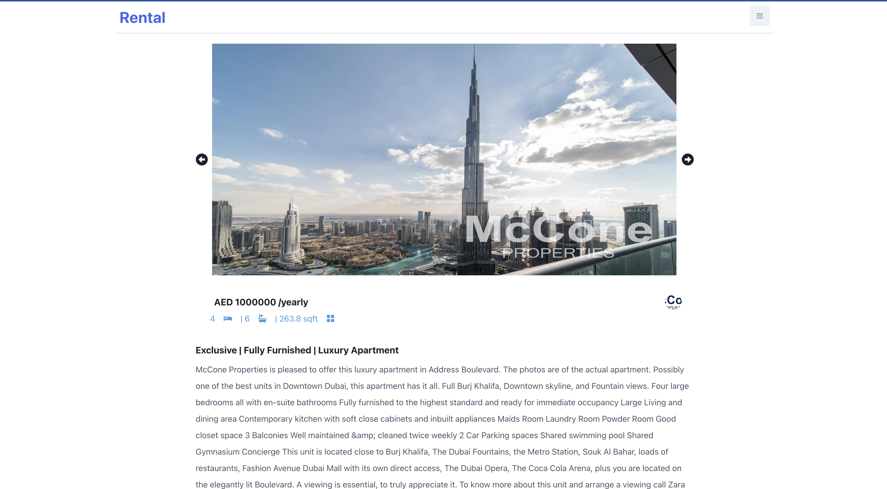

 <h1>Rental</h1>

## Description 🦚

Welcome to our ReactJS Rental app project!

Our Rental app project is a web application that allows users to browse and search properties.

Some of the key features of our Rental app project include:

- **PWA**
- **Property catalog**
- **Search and filter**
- **Property details**

## Screenshots 🖼

- **Home Page**  
      
- **Properties**  
      
- **Single Propertie Details**  
      

## ToDo

- [ ] Working on Realtime API's Properties and Improving UI.

## Acknowledgements 🙏

- [Vercel](https://rentall.vercel.app/)
